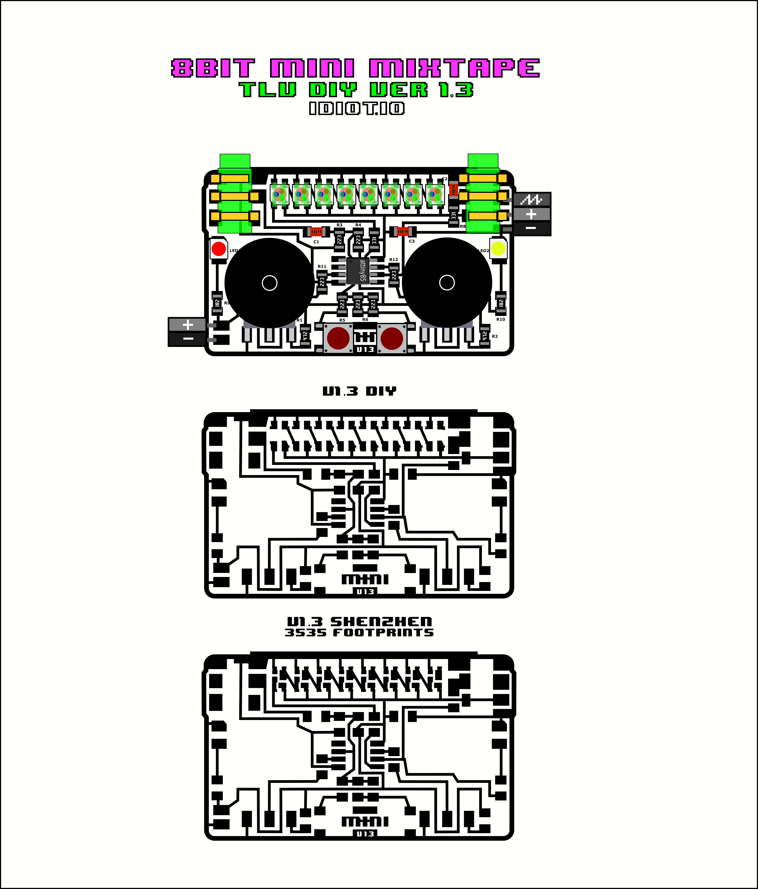

### see release

there are previous versions in the release folder, for the hand etched v1.4b and the mini 8BitMiniMixtape-TLV

an earlier, hand-etched prototpye  

#### Joining the 8Bit Mixtape Madness!!  

Discussion group on all kinda codes, soundzz and new developments for the 8Bit-Mixtape.  

Follow on github:
[8Bit Mixtape github](https://github.com/8BitMixtape)  

and more documentation on the SGMK wiki:
[8Bit Mixtape wiki](http://wiki.sgmk-ssam.ch/wiki/8bit_Mix_Tape)

[svg file](8BitMiniMixtape-TLV.svg)

##### PCB Layout Design
  

##### Flexible PCB Photolithography Process Using Photoresist Dry Film & Pyralux
UV Exposure 1:45 Min  

Soudium Carbonate 2g:200ml water  

video soon...

##### Etching Using Ferric chloride
ferric 1:1 water  

this is a post mortem release.
included is a photo of the color chart from PCBway fab and color matched in SVG

(we Should Ditch the ferric and switch to NaPS approx 200-300g per liter water at 50C)

* Made Few design mistakes with 3535 LEDS Pads... fixed now!!

##### First working Mini Mixtape Test! on FR4 Clad
Etched With NaPS & Assembled by The 8Bit Mixtape Guru Master Marc Dusseiller Dusjagr!!!

